# Polyglot Codebase Knowledge Graph

> Generated offline by **readmenator**. Supports C, C++, Python, Go, Rust, JS/TS, Java, C#, Shell, PHP, Dart, GDScript, Nim, ASM, Ruby, Swift, Kotlin, Scala, Lua, Elixir.
> No LLMs. No tokens. Pure static analysis. See more [here](https://github.com/grisuno/ReadMenator)

**Total Files Parsed:** 2 | **Total Symbols Extracted:** 83 | **Total Imports:** 19

<!-- ranking_model: v1.0 | weights: {ppr:0.45,auth:0.2,test:0.15,doc:0.1,fresh:0.1} | alpha:0.85 | commit:f0ae16d | date:2026-07-18 -->


## Table of Contents

1. [Statistics Dashboard](#statistics-dashboard)
2. [Architectural Layers](#architectural-layers)
3. [Ranked Context](#ranked-context)
4. [God Nodes](#god-nodes)
5. [Suggested Questions](#suggested-questions)
6. [Taint Propagation Map](#taint-propagation-map)
7. [Hotspot Analysis](#hotspot-analysis)
8. [Change Impact Analysis](#change-impact-analysis)
9. [Suggested Linting Rules](#suggested-linting-rules)
10. [Orphans](#orphans)
11. [Query Recipes](#query-recipes)
12. [Structural Knowledge Map](#structural-knowledge-map)
13. [UML Class Diagram](#uml-class-diagram)
14. [Code Property Graph](#code-property-graph)
15. [Architecture Reference](#architecture-reference)
    - [PY (1 files)](#py-1-files)
    - [SH (1 files)](#sh-1-files)

---

## Statistics Dashboard

| Metric | Value |
|--------|-------|
| Total Files | 2 |
| Total Symbols | 83 |
| Total Imports | 19 |
| Call Edges | 409 |
| Inheritance Edges | 2 |
| Languages | 2 |
| Avg Symbols/File | 41.5 |
| Avg Imports/File | 9.5 |

### Top Files by Import Count (Fan-Out)

| File | Imports | Symbols | Language |
|------|---------|---------|----------|
| `app.py` | 19 | 83 | py |

---

## Architectural Layers

Auto-detected from path patterns, naming conventions, and imported frameworks.

| Layer | Files |
|-------|-------|
| utility | 2 |

### utility

- `app.py` (py, 83 symbols)
- `install.sh` (sh, 0 symbols)

---

## Ranked Context

Files ranked by composite score for the current query context. The ranking combines Personalized PageRank (query relevance), global authority, test coverage, documentation coverage, and code freshness. Model: v1.0.

| Rank | File | Composite | PPR | Authority | Test | Doc |
|------|------|-----------|-----|-----------|------|-----|
| 1 | `app.py` | 0.0892 | 0.0000 | 0.0000 | 0.00 | 0.89 |
| 2 | `install.sh` | 0.0000 | 0.0000 | 0.0000 | 0.00 | 0.00 |

---

## God Nodes

Most architecturally central files ranked by combined import/export degree and symbol richness.

| File | Score | Connections | PageRank |
|------|-------|-------------|----------|
| `app.py` | 8.3 | | 0.0000 |
| `install.sh` | 0.0 | | 0.0000 |

---

## Suggested Questions

Auto-generated exploration prompts based on graph structure:

- What does app.py depend on, and what depends on it? (0 connections)
- What does install.sh depend on, and what depends on it? (0 connections)
- What is Task in app.py and how is it used?
- What is the overall architecture of this codebase?

---

## Taint Propagation Map

Taint analysis traces how dangerous imports propagate through the codebase via transitive dependencies. Source files import dangerous modules directly; sink files receive the danger indirectly.

**Taint Sources:** 1 | **Taint Sinks:** 1 | **Propagation Paths:** 1

- `app.py` imports `requests` (0 hop to `app.py`) [medium]
  Path: app.py

---

## Hotspot Analysis

Files ranked by combined complexity (symbol count) and centrality (connection count). High-scoring files are architecturally critical and may need refactoring attention.

| File | Complexity | Centrality | Combined | Symbols | Connections |
|------|-----------|------------|----------|---------|-------------|
| `app.py` | 1.000 | 1.000 | 1.000 | 83 | 19 |
| `install.sh` | 0.000 | 0.000 | 0.000 | 0 | 0 |

---

## Change Impact Analysis

Files sorted by how many other files would be affected if they changed. High-impact files should be changed with caution.

| File | Direct Dependents | Transitive Dependents | Total Impact |
|------|------------------|----------------------|--------------|
| `app.py` | 0 | 0 | 0 |
| `install.sh` | 0 | 0 | 0 |

---

## Suggested Linting Rules

Automatically suggested linting and security rules based on patterns detected in the codebase. These can be exported as Semgrep rules using the `--export-rules` flag.

| Rule ID | Severity | Description | Language | Matches |
|---------|----------|-------------|----------|---------|
| `RM002` | warning | Bare except clause catches all exceptions including SystemExit | python | 7 |
| `RM001` | info | Large number of functions in py: 75 total | py | 75 |

---

## Orphans

Files with no documentation or low connectivity. These are candidates for documentation investment or cleanup.

- `install.sh` (0 symbols, no doc)

---

## Query Recipes

Example queries you can run against this knowledge base using the ranking engine:

```
# Find files most relevant to a concept
readmenator query "Where is the import resolver implemented?"

# Rank files by relevance to a topic
readmenator query "How does documentation generation work?"

# Explain why a file ranks highly
readmenator query "explain readmenator/_documentation.py"

# Trace dependency paths with ranked context
readmenator query "path from CLI to exporter"
```

The ranking model uses the following signals:

- **Personalized PageRank** (45% weight): query-specific relevance via seed propagation
- **Global Authority** (20% weight): structural importance via standard PageRank
- **Test Coverage** (15% weight): fraction of symbols referenced in test files
- **Doc Coverage** (10% weight): presence of docstrings and file-level docs
- **Freshness** (10% weight): recent modification activity

Results include score decomposition and justification paths for each ranked item.

---

## Structural Knowledge Map

```mermaid
graph TD
    classDef mod fill:#1e1e1e,stroke:#ff6666,stroke-width:2px,color:#fff;
    classDef cls fill:#2d2d2d,stroke:#4ec9b0,stroke-width:2px,color:#fff;
    classDef fn fill:#333,stroke:#dcdcaa,stroke-width:1px,color:#dcdcaa;
    classDef ext fill:#111,stroke:#666,stroke-dasharray: 5 5,color:#aaa;
    app_py["app.py (py)"]
    class app_py mod;
    app_py_Task["Task"]
    class app_py_Task cls;
    app_py --> app_py_Task
    app_py_MemoryBank["MemoryBank"]
    class app_py_MemoryBank cls;
    app_py --> app_py_MemoryBank
    app_py_CurriculumLearning["CurriculumLearning"]
    class app_py_CurriculumLearning cls;
    app_py --> app_py_CurriculumLearning
    app_py_AbsoluteZeroCmd["AbsoluteZeroCmd"]
    class app_py_AbsoluteZeroCmd cls;
    app_py --> app_py_AbsoluteZeroCmd
    app_py_SelfPlayTraining["SelfPlayTraining"]
    class app_py_SelfPlayTraining cls;
    app_py --> app_py_SelfPlayTraining
    install_sh["install.sh (sh)"]
    class install_sh mod;
    ext_os["os"]
    class ext_os ext;
    app_py -.->|imports| ext_os
    ext_json["json"]
    class ext_json ext;
    app_py -.->|imports| ext_json
    ext_random["random"]
    class ext_random ext;
    app_py -.->|imports| ext_random
    ext_re["re"]
    class ext_re ext;
    app_py -.->|imports| ext_re
    ext_logging["logging"]
    class ext_logging ext;
    app_py -.->|imports| ext_logging
    ext_requests["requests"]
    class ext_requests ext;
    app_py -.->|imports| ext_requests
    ext_collections["collections"]
    class ext_collections ext;
    app_py -.->|imports| ext_collections
    ext_cmd2["cmd2"]
    class ext_cmd2 ext;
    app_py -.->|imports| ext_cmd2
    ext_argparse["argparse"]
    class ext_argparse ext;
    app_py -.->|imports| ext_argparse
    ext_rich_console["rich.console"]
    class ext_rich_console ext;
    app_py -.->|imports| ext_rich_console
    ext_rich_progress["rich.progress"]
    class ext_rich_progress ext;
    app_py -.->|imports| ext_rich_progress
    ext_numpy["numpy"]
    class ext_numpy ext;
    app_py -.->|imports| ext_numpy
    ext_datetime["datetime"]
    class ext_datetime ext;
    app_py -.->|imports| ext_datetime
    ext_hashlib["hashlib"]
    class ext_hashlib ext;
    app_py -.->|imports| ext_hashlib
    ext_typing["typing"]
    class ext_typing ext;
    app_py -.->|imports| ext_typing
    ext_threading["threading"]
    class ext_threading ext;
    app_py -.->|imports| ext_threading
    ext_time["time"]
    class ext_time ext;
    app_py -.->|imports| ext_time
    ext_dataclasses["dataclasses"]
    class ext_dataclasses ext;
    app_py -.->|imports| ext_dataclasses
    ext_pickle["pickle"]
    class ext_pickle ext;
    app_py -.->|imports| ext_pickle
```



---

## UML Class Diagram

Auto-generated Mermaid class diagram from parsed class-level symbols. Shows classes, structs, interfaces, traits, and their methods with inheritance and dependency relationships.

```mermaid
classDiagram
  class app_py_Task {
    <<class>>
    +__post_init__(self)
    +_compute_hash(self)
    +success_rate(self)
    +to_dict(self)
    +__init__(self, persist_path)
    +add_task(self, task)
    +_is_too_similar(self, new_task)
    +_simple_embedding(self, program)
    +_maintain_buffer_size(self, task_type)
    +get_reference_tasks(self, task_type, n)
  }
  class app_py_MemoryBank {
    <<class>>
    +__post_init__(self)
    +_compute_hash(self)
    +success_rate(self)
    +to_dict(self)
    +__init__(self, persist_path)
    +add_task(self, task)
    +_is_too_similar(self, new_task)
    +_simple_embedding(self, program)
    +_maintain_buffer_size(self, task_type)
    +get_reference_tasks(self, task_type, n)
  }
  class app_py_CurriculumLearning {
    <<class>>
    +__post_init__(self)
    +_compute_hash(self)
    +success_rate(self)
    +to_dict(self)
    +__init__(self, persist_path)
    +add_task(self, task)
    +_is_too_similar(self, new_task)
    +_simple_embedding(self, program)
    +_maintain_buffer_size(self, task_type)
    +get_reference_tasks(self, task_type, n)
  }
  class app_py_AbsoluteZeroCmd {
    <<class>>
    +__post_init__(self)
    +_compute_hash(self)
    +success_rate(self)
    +to_dict(self)
    +__init__(self, persist_path)
    +add_task(self, task)
    +_is_too_similar(self, new_task)
    +_simple_embedding(self, program)
    +_maintain_buffer_size(self, task_type)
    +get_reference_tasks(self, task_type, n)
  }
  class app_py_SelfPlayTraining {
    <<class>>
    +__post_init__(self)
    +_compute_hash(self)
    +success_rate(self)
    +to_dict(self)
    +__init__(self, persist_path)
    +add_task(self, task)
    +_is_too_similar(self, new_task)
    +_simple_embedding(self, program)
    +_maintain_buffer_size(self, task_type)
    +get_reference_tasks(self, task_type, n)
  }
  class app_py_MetaLearning {
    <<class>>
    +__post_init__(self)
    +_compute_hash(self)
    +success_rate(self)
    +to_dict(self)
    +__init__(self, persist_path)
    +add_task(self, task)
    +_is_too_similar(self, new_task)
    +_simple_embedding(self, program)
    +_maintain_buffer_size(self, task_type)
    +get_reference_tasks(self, task_type, n)
  }
  class app_py_AdvancedAnalytics {
    <<class>>
    +__post_init__(self)
    +_compute_hash(self)
    +success_rate(self)
    +to_dict(self)
    +__init__(self, persist_path)
    +add_task(self, task)
    +_is_too_similar(self, new_task)
    +_simple_embedding(self, program)
    +_maintain_buffer_size(self, task_type)
    +get_reference_tasks(self, task_type, n)
  }
  class app_py_AbsoluteZeroCmd {
    <<class>>
    +__post_init__(self)
    +_compute_hash(self)
    +success_rate(self)
    +to_dict(self)
    +__init__(self, persist_path)
    +add_task(self, task)
    +_is_too_similar(self, new_task)
    +_simple_embedding(self, program)
    +_maintain_buffer_size(self, task_type)
    +get_reference_tasks(self, task_type, n)
  }
```



---

## Code Property Graph

Machine-readable Code Property Graph (CPG) in JSON-LD format. This block allows AI agents to parse the full structural graph without additional file reads. Compatible with GraphRAG pipelines.

```json
{"@context": "https://schema.org", "analysis": {"communities": [], "god_nodes": [{"node_id": "app.py", "score": 8.3}, {"node_id": "install.sh", "score": 0.0}], "surprising_connections": []}, "edges": [{"confidence": "EXTRACTED", "relation": "imports", "source": "app.py", "target": "os"}, {"confidence": "EXTRACTED", "relation": "imports", "source": "app.py", "target": "json"}, {"confidence": "EXTRACTED", "relation": "imports", "source": "app.py", "target": "random"}, {"confidence": "EXTRACTED", "relation": "imports", "source": "app.py", "target": "re"}, {"confidence": "EXTRACTED", "relation": "imports", "source": "app.py", "target": "logging"}, {"confidence": "EXTRACTED", "relation": "imports", "source": "app.py", "target": "requests"}, {"confidence": "EXTRACTED", "relation": "imports", "source": "app.py", "target": "collections"}, {"confidence": "EXTRACTED", "relation": "imports", "source": "app.py", "target": "cmd2"}, {"confidence": "EXTRACTED", "relation": "imports", "source": "app.py", "target": "argparse"}, {"confidence": "EXTRACTED", "relation": "imports", "source": "app.py", "target": "rich.console"}, {"confidence": "EXTRACTED", "relation": "imports", "source": "app.py", "target": "rich.progress"}, {"confidence": "EXTRACTED", "relation": "imports", "source": "app.py", "target": "numpy"}, {"confidence": "EXTRACTED", "relation": "imports", "source": "app.py", "target": "datetime"}, {"confidence": "EXTRACTED", "relation": "imports", "source": "app.py", "target": "hashlib"}, {"confidence": "EXTRACTED", "relation": "imports", "source": "app.py", "target": "typing"}, {"confidence": "EXTRACTED", "relation": "imports", "source": "app.py", "target": "threading"}, {"confidence": "EXTRACTED", "relation": "imports", "source": "app.py", "target": "time"}, {"confidence": "EXTRACTED", "relation": "imports", "source": "app.py", "target": "dataclasses"}, {"confidence": "EXTRACTED", "relation": "imports", "source": "app.py", "target": "pickle"}], "generator": "readmenator", "metadata": {"edge_count": 430, "file_count": 2, "language_count": 2, "symbol_count": 83}, "nodes": [{"doc": "_*_ coding: utf8 _*_", "id": "app.py", "kind": "module", "label": "app.py", "language": "py", "sha256": "b0390bbb6e0d1af5", "symbol_count": 83, "symbols": [{"doc": "Estructura mejorada para tareas con metadatos.", "kind": "class", "line": 62, "name": "Task", "signature": "class Task"}, {"doc": "Sistema de memoria mejorado con persistencia y clustering.", "kind": "class", "line": 93, "name": "MemoryBank", "signature": "class MemoryBank"}, {"doc": "Sistema de aprendizaje curricular que ajusta dificultad automáticamente.", "kind": "class", "line": 185, "name": "CurriculumLearning", "signature": "class CurriculumLearning"}, {"doc": "Sistema Absolute Zero mejorado con características avanzadas.", "kind": "class", "line": 217, "name": "AbsoluteZeroCmd", "signature": "class AbsoluteZeroCmd(Cmd)"}, {"doc": "Sistema de entrenamiento por auto-juego avanzado.", "kind": "class", "line": 744, "name": "SelfPlayTraining", "signature": "class SelfPlayTraining"}, {"doc": "Sistema de meta-aprendizaje para optimización de hiperparámetros.", "kind": "class", "line": 871, "name": "MetaLearning", "signature": "class MetaLearning"}, {"doc": "Sistema de análisis avanzado y visualización.", "kind": "class", "line": 984, "name": "AdvancedAnalytics", "signature": "class AdvancedAnalytics"}, {"doc": "Extensión de la clase principal con funcionalidades avanzadas.", "kind": "class", "line": 1064, "name": "AbsoluteZeroCmd", "signature": "class AbsoluteZeroCmd(AbsoluteZeroCmd)"}, {"kind": "method", "line": 75, "name": "__post_init__", "signature": "def __post_init__(self)"}, {"doc": "Computa hash único para detectar duplicados.", "kind": "method", "line": 81, "name": "_compute_hash", "signature": "def _compute_hash(self)"}, {"kind": "method", "line": 87, "name": "success_rate", "signature": "def success_rate(self)"}, {"kind": "method", "line": 90, "name": "to_dict", "signature": "def to_dict(self)"}, {"kind": "method", "line": 96, "name": "__init__", "signature": "def __init__(self, persist_path)"}, {"doc": "Añade tarea si no es duplicada y cumple criterios de calidad.", "kind": "method", "line": 103, "name": "add_task", "signature": "def add_task(self, task)"}, {"doc": "Verifica si la tarea es muy similar a las existentes.", "kind": "method", "line": 120, "name": "_is_too_similar", "signature": "def _is_too_similar(self, new_task)"}, {"doc": "Crea embedding simple del programa.", "kind": "method", "line": 137, "name": "_simple_embedding", "signature": "def _simple_embedding(self, program)"}, {"doc": "Mantiene el tamaño del buffer removiendo tareas con peor rendimiento.", "kind": "method", "line": 149, "name": "_maintain_buffer_size", "signature": "def _maintain_buffer_size(self, task_type)"}, {"doc": "Obtiene tareas de referencia con muestreo inteligente.", "kind": "method", "line": 156, "name": "get_reference_tasks", "signature": "def get_reference_tasks(self, task_type, n)"}, {"doc": "Guarda el banco de memoria en disco.", "kind": "method", "line": 167, "name": "save_to_disk", "signature": "def save_to_disk(self)"}, {"doc": "Carga el banco de memoria desde disco.", "kind": "method", "line": 175, "name": "load_from_disk", "signature": "def load_from_disk(self)"}, {"kind": "method", "line": 188, "name": "__init__", "signature": "def __init__(self)"}, {"doc": "Actualiza rendimiento y ajusta dificultad.", "kind": "method", "line": 198, "name": "update_performance", "signature": "def update_performance(self, reward)"}, {"doc": "Ajusta dificultad basada en rendimiento.", "kind": "method", "line": 205, "name": "_adjust_difficulty", "signature": "def _adjust_difficulty(self, avg_performance)"}, {"kind": "method", "line": 220, "name": "__init__", "signature": "def __init__(self)"}, {"doc": "Inicializa con triplete semilla mejorado.", "kind": "method", "line": 237, "name": "_initialize_with_seed", "signature": "def _initialize_with_seed(self)"}, {"doc": "Analiza código con opciones avanzadas.", "kind": "method", "line": 258, "name": "do_analyze", "signature": "def do_analyze(self, args)"}, {"doc": "Muestra estadísticas del sistema.", "kind": "method", "line": 267, "name": "do_stats", "signature": "def do_stats(self, arg)"}, {"doc": "Muestra estado del curriculum learning.", "kind": "method", "line": 282, "name": "do_curriculum", "signature": "def do_curriculum(self, arg)"}, {"doc": "Guarda manualmente el banco de memoria.", "kind": "method", "line": 289, "name": "do_save_memory", "signature": "def do_save_memory(self, arg)"}, {"doc": "Análisis secuencial mejorado.", "kind": "method", "line": 296, "name": "_analyze_sequential", "signature": "def _analyze_sequential(self, directory, iterations)"}, {"doc": "Análisis paralelo con threading.", "kind": "method", "line": 309, "name": "_analyze_parallel", "signature": "def _analyze_parallel(self, directory, iterations)"}, {"doc": "Obtiene lista de archivos de código.", "kind": "method", "line": 326, "name": "_get_code_files", "signature": "def _get_code_files(self, directory)"}, {"doc": "Análisis mejorado de archivo de código.", "kind": "method", "line": 335, "name": "_analyze_code_file", "signature": "def _analyze_code_file(self, file_path, iterations)"}, {"doc": "Ciclo principal mejorado con métricas.", "kind": "method", "line": 346, "name": "_absolute_zero_loop", "signature": "def _absolute_zero_loop(self, code_content, file_path, iterations)"}, {"doc": "Propone tareas con dificultad adaptativa.", "kind": "method", "line": 364, "name": "_propose_tasks_adaptive", "signature": "def _propose_tasks_adaptive(self, code_content, file_path)"}, {"doc": "Construye prompt adaptativo basado en dificultad.", "kind": "method", "line": 393, "name": "_build_adaptive_propose_prompt", "signature": "def _build_adaptive_propose_prompt(self, task_type, code_content, ref_tasks, difficulty)"}, {"doc": "Consulta API con manejo de errores mejorado y reintentos.", "kind": "method", "line": 423, "name": "_query_deepseek_improved", "signature": "def _query_deepseek_improved(self, prompt)"}, {"doc": "Validación mejorada con más verificaciones.", "kind": "method", "line": 457, "name": "_validate_task_improved", "signature": "def _validate_task_improved(self, task)"}, {"doc": "Verifica si el programa es ejecutable.", "kind": "method", "line": 482, "name": "_is_executable", "signature": "def _is_executable(self, program)"}, {"doc": "Valida tarea de deducción.", "kind": "method", "line": 490, "name": "_validate_deduction_task", "signature": "def _validate_deduction_task(self, task)"}, {"doc": "Valida tarea de abducción.", "kind": "method", "line": 504, "name": "_validate_abduction_task", "signature": "def _validate_abduction_task(self, task)"}, {"doc": "Valida tarea de inducción.", "kind": "method", "line": 516, "name": "_validate_induction_task", "signature": "def _validate_induction_task(self, task)"}, {"doc": "Extrae nombre de función del programa.", "kind": "method", "line": 533, "name": "_extract_function_name", "signature": "def _extract_function_name(self, program)"}, {"doc": "Resolución mejorada de tareas con métricas detalladas.", "kind": "method", "line": 538, "name": "_solve_tasks_improved", "signature": "def _solve_tasks_improved(self, tasks, file_path)"}, {"doc": "Construye prompt mejorado de resolución.", "kind": "method", "line": 577, "name": "_build_solve_prompt_improved", "signature": "def _build_solve_prompt_improved(self, task)"}, {"doc": "Extrae solución con múltiples estrategias.", "kind": "method", "line": 617, "name": "_extract_solution_improved", "signature": "def _extract_solution_improved(self, response, task_type)"}, {"doc": "Cálculo mejorado de recompensa con múltiples factores.", "kind": "method", "line": 634, "name": "_calculate_reward_improved", "signature": "def _calculate_reward_improved(self, task, solution)"}, {"doc": "Verifica solución de deducción.", "kind": "method", "line": 657, "name": "_verify_deduction_solution", "signature": "def _verify_deduction_solution(self, task, solution)"}, {"doc": "Verifica solución de abducción.", "kind": "method", "line": 669, "name": "_verify_abduction_solution", "signature": "def _verify_abduction_solution(self, task, solution)"}, {"doc": "Verifica solución de inducción.", "kind": "method", "line": 681, "name": "_verify_induction_solution", "signature": "def _verify_induction_solution(self, task, solution)"}, {"doc": "Calcula recompensa promedio de todas las soluciones.", "kind": "method", "line": 704, "name": "_calculate_average_reward", "signature": "def _calculate_average_reward(self, solutions)"}, {"doc": "Actualización mejorada del modelo con normalización adaptativa.", "kind": "method", "line": 712, "name": "_update_model_improved", "signature": "def _update_model_improved(self, tasks, solutions)"}, {"kind": "method", "line": 747, "name": "__init__", "signature": "def __init__(self, memory_bank, cmd_instance)"}, {"doc": "Ejecuta torneo entre diferentes versiones del modelo.", "kind": "method", "line": 753, "name": "run_tournament", "signature": "def run_tournament(self, rounds)"}, {"doc": "Selecciona tareas diversas para el torneo.", "kind": "method", "line": 778, "name": "_select_tournament_tasks", "signature": "def _select_tournament_tasks(self, n_tasks)"}, {"doc": "Evalúa una ronda del torneo.", "kind": "method", "line": 797, "name": "_evaluate_tournament_round", "signature": "def _evaluate_tournament_round(self, tasks)"}, {"doc": "Evalúa una tarea individual con el modelo actual.", "kind": "method", "line": 821, "name": "_evaluate_single_task", "signature": "def _evaluate_single_task(self, task)"}, {"doc": "Evalúa con un modelo baseline simple.", "kind": "method", "line": 831, "name": "_evaluate_baseline_task", "signature": "def _evaluate_baseline_task(self, task)"}, {"doc": "Actualiza ratings ELO basado en resultados.", "kind": "method", "line": 841, "name": "_update_elo_ratings", "signature": "def _update_elo_ratings(self, results)"}, {"doc": "Muestra resumen del torneo.", "kind": "method", "line": 857, "name": "_display_tournament_summary", "signature": "def _display_tournament_summary(self)"}, {"kind": "method", "line": 874, "name": "__init__", "signature": "def __init__(self)"}, {"doc": "Optimiza hiperparámetros usando búsqueda aleatoria.", "kind": "method", "line": 887, "name": "optimize_hyperparameters", "signature": "def optimize_hyperparameters(self, cmd_instance, iterations)"}, {"doc": "Genera nuevos hiperparámetros usando búsqueda aleatoria.", "kind": "method", "line": 917, "name": "_generate_hyperparameters", "signature": "def _generate_hyperparameters(self)"}, {"doc": "Aplica hiperparámetros al sistema.", "kind": "method", "line": 927, "name": "_apply_hyperparameters", "signature": "def _apply_hyperparameters(self, cmd_instance, hyperparams)"}, {"doc": "Evalúa performance del sistema con hiperparámetros actuales.", "kind": "method", "line": 936, "name": "_evaluate_performance", "signature": "def _evaluate_performance(self, cmd_instance)"}, {"doc": "Genera tareas de prueba para evaluación.", "kind": "method", "line": 952, "name": "_generate_test_tasks", "signature": "def _generate_test_tasks(self)"}, {"doc": "Muestra resumen de optimización.", "kind": "method", "line": 976, "name": "_display_optimization_summary", "signature": "def _display_optimization_summary(self)"}, {"kind": "method", "line": 987, "name": "__init__", "signature": "def __init__(self)"}, {"doc": "Rastrea creación de tareas.", "kind": "method", "line": 996, "name": "track_task_creation", "signature": "def track_task_creation(self, task)"}, {"doc": "Rastrea performance del sistema.", "kind": "method", "line": 1005, "name": "track_performance", "signature": "def track_performance(self, reward, task_type)"}, {"doc": "Rastrea velocidad de aprendizaje.", "kind": "method", "line": 1013, "name": "track_learning_velocity", "signature": "def track_learning_velocity(self, success_rate)"}, {"doc": "Rastrea errores del sistema.", "kind": "method", "line": 1020, "name": "track_error", "signature": "def track_error(self, error_type, context)"}, {"doc": "Genera reporte de analytics detallado.", "kind": "method", "line": 1027, "name": "generate_report", "signature": "def generate_report(self)"}, {"doc": "Guarda reporte de analytics.", "kind": "method", "line": 1056, "name": "save_analytics", "signature": "def save_analytics(self, filepath)"}, {"kind": "method", "line": 1067, "name": "__init__", "signature": "def __init__(self)"}, {"doc": "Ejecuta torneo de auto-juego.", "kind": "method", "line": 1076, "name": "do_tournament", "signature": "def do_tournament(self, arg)"}, {"doc": "Optimiza hiperparámetros del sistema.", "kind": "method", "line": 1084, "name": "do_optimize", "signature": "def do_optimize(self, arg)"}, {"doc": "Genera y muestra reporte de analytics.", "kind": "method", "line": 1092, "name": "do_analytics", "signature": "def do_analytics(self, arg)"}, {"doc": "Exporta tareas a archivo JSON.", "kind": "method", "line": 1100, "name": "do_export_tasks", "signature": "def do_export_tasks(self, arg)"}, {"doc": "Importa tareas desde archivo JSON.", "kind": "method", "line": 1111, "name": "do_import_tasks", "signature": "def do_import_tasks(self, arg)"}, {"doc": "Ejecuta benchmark de performance del sistema.", "kind": "method", "line": 1132, "name": "do_benchmark", "signature": "def do_benchmark(self, arg)"}, {"doc": "Crea conjunto estándar de tareas para benchmark.", "kind": "method", "line": 1171, "name": "_create_benchmark_tasks", "signature": "def _create_benchmark_tasks(self)"}, {"doc": "Ciclo principal con analytics integrados.", "kind": "method", "line": 1199, "name": "_absolute_zero_loop", "signature": "def _absolute_zero_loop(self, code_content, file_path, iterations)"}]}, {"id": "install.sh", "kind": "module", "label": "install.sh", "language": "sh", "sha256": "c907d80fd6734993", "symbol_count": 0, "symbols": []}], "type": "CodePropertyGraph", "version": "1.0"}
```

---

## Architecture Reference

### PY (1 files)

#### `app.py`
**Path:** `app.py`
**File Doc:** *_*_ coding: utf8 _*_*

**Classes:**
- `Task` (line 62) `class Task` - *Estructura mejorada para tareas con metadatos.*
- `MemoryBank` (line 93) `class MemoryBank` - *Sistema de memoria mejorado con persistencia y clustering.*
- `CurriculumLearning` (line 185) `class CurriculumLearning` - *Sistema de aprendizaje curricular que ajusta dificultad automáticamente.*
- `AbsoluteZeroCmd` (line 217) `class AbsoluteZeroCmd(Cmd)` - *Sistema Absolute Zero mejorado con características avanzadas.*
- `SelfPlayTraining` (line 744) `class SelfPlayTraining` - *Sistema de entrenamiento por auto-juego avanzado.*
- `MetaLearning` (line 871) `class MetaLearning` - *Sistema de meta-aprendizaje para optimización de hiperparámetros.*
- `AdvancedAnalytics` (line 984) `class AdvancedAnalytics` - *Sistema de análisis avanzado y visualización.*
- `AbsoluteZeroCmd` (line 1064) `class AbsoluteZeroCmd(AbsoluteZeroCmd)` - *Extensión de la clase principal con funcionalidades avanzadas.*

**Methods:**
- `__post_init__` (line 75) `def __post_init__(self)`
- `_compute_hash` (line 81) `def _compute_hash(self)` - *Computa hash único para detectar duplicados.*
- `success_rate` (line 87) `def success_rate(self)`
- `to_dict` (line 90) `def to_dict(self)`
- `__init__` (line 96) `def __init__(self, persist_path)`
- `add_task` (line 103) `def add_task(self, task)` - *Añade tarea si no es duplicada y cumple criterios de calidad.*
- `_is_too_similar` (line 120) `def _is_too_similar(self, new_task)` - *Verifica si la tarea es muy similar a las existentes.*
- `_simple_embedding` (line 137) `def _simple_embedding(self, program)` - *Crea embedding simple del programa.*
- `_maintain_buffer_size` (line 149) `def _maintain_buffer_size(self, task_type)` - *Mantiene el tamaño del buffer removiendo tareas con peor rendimiento.*
- `get_reference_tasks` (line 156) `def get_reference_tasks(self, task_type, n)` - *Obtiene tareas de referencia con muestreo inteligente.*
- `save_to_disk` (line 167) `def save_to_disk(self)` - *Guarda el banco de memoria en disco.*
- `load_from_disk` (line 175) `def load_from_disk(self)` - *Carga el banco de memoria desde disco.*
- `__init__` (line 188) `def __init__(self)`
- `update_performance` (line 198) `def update_performance(self, reward)` - *Actualiza rendimiento y ajusta dificultad.*
- `_adjust_difficulty` (line 205) `def _adjust_difficulty(self, avg_performance)` - *Ajusta dificultad basada en rendimiento.*
- `__init__` (line 220) `def __init__(self)`
- `_initialize_with_seed` (line 237) `def _initialize_with_seed(self)` - *Inicializa con triplete semilla mejorado.*
- `do_analyze` (line 258) `def do_analyze(self, args)` - *Analiza código con opciones avanzadas.*
- `do_stats` (line 267) `def do_stats(self, arg)` - *Muestra estadísticas del sistema.*
- `do_curriculum` (line 282) `def do_curriculum(self, arg)` - *Muestra estado del curriculum learning.*
- `do_save_memory` (line 289) `def do_save_memory(self, arg)` - *Guarda manualmente el banco de memoria.*
- `_analyze_sequential` (line 296) `def _analyze_sequential(self, directory, iterations)` - *Análisis secuencial mejorado.*
- `_analyze_parallel` (line 309) `def _analyze_parallel(self, directory, iterations)` - *Análisis paralelo con threading.*
- `_get_code_files` (line 326) `def _get_code_files(self, directory)` - *Obtiene lista de archivos de código.*
- `_analyze_code_file` (line 335) `def _analyze_code_file(self, file_path, iterations)` - *Análisis mejorado de archivo de código.*
- `_absolute_zero_loop` (line 346) `def _absolute_zero_loop(self, code_content, file_path, iterations)` - *Ciclo principal mejorado con métricas.*
- `_propose_tasks_adaptive` (line 364) `def _propose_tasks_adaptive(self, code_content, file_path)` - *Propone tareas con dificultad adaptativa.*
- `_build_adaptive_propose_prompt` (line 393) `def _build_adaptive_propose_prompt(self, task_type, code_content, ref_tasks, difficulty)` - *Construye prompt adaptativo basado en dificultad.*
- `_query_deepseek_improved` (line 423) `def _query_deepseek_improved(self, prompt)` - *Consulta API con manejo de errores mejorado y reintentos.*
- `_validate_task_improved` (line 457) `def _validate_task_improved(self, task)` - *Validación mejorada con más verificaciones.*
- `_is_executable` (line 482) `def _is_executable(self, program)` - *Verifica si el programa es ejecutable.*
- `_validate_deduction_task` (line 490) `def _validate_deduction_task(self, task)` - *Valida tarea de deducción.*
- `_validate_abduction_task` (line 504) `def _validate_abduction_task(self, task)` - *Valida tarea de abducción.*
- `_validate_induction_task` (line 516) `def _validate_induction_task(self, task)` - *Valida tarea de inducción.*
- `_extract_function_name` (line 533) `def _extract_function_name(self, program)` - *Extrae nombre de función del programa.*
- `_solve_tasks_improved` (line 538) `def _solve_tasks_improved(self, tasks, file_path)` - *Resolución mejorada de tareas con métricas detalladas.*
- `_build_solve_prompt_improved` (line 577) `def _build_solve_prompt_improved(self, task)` - *Construye prompt mejorado de resolución.*
- `_extract_solution_improved` (line 617) `def _extract_solution_improved(self, response, task_type)` - *Extrae solución con múltiples estrategias.*
- `_calculate_reward_improved` (line 634) `def _calculate_reward_improved(self, task, solution)` - *Cálculo mejorado de recompensa con múltiples factores.*
- `_verify_deduction_solution` (line 657) `def _verify_deduction_solution(self, task, solution)` - *Verifica solución de deducción.*
- `_verify_abduction_solution` (line 669) `def _verify_abduction_solution(self, task, solution)` - *Verifica solución de abducción.*
- `_verify_induction_solution` (line 681) `def _verify_induction_solution(self, task, solution)` - *Verifica solución de inducción.*
- `_calculate_average_reward` (line 704) `def _calculate_average_reward(self, solutions)` - *Calcula recompensa promedio de todas las soluciones.*
- `_update_model_improved` (line 712) `def _update_model_improved(self, tasks, solutions)` - *Actualización mejorada del modelo con normalización adaptativa.*
- `__init__` (line 747) `def __init__(self, memory_bank, cmd_instance)`
- `run_tournament` (line 753) `def run_tournament(self, rounds)` - *Ejecuta torneo entre diferentes versiones del modelo.*
- `_select_tournament_tasks` (line 778) `def _select_tournament_tasks(self, n_tasks)` - *Selecciona tareas diversas para el torneo.*
- `_evaluate_tournament_round` (line 797) `def _evaluate_tournament_round(self, tasks)` - *Evalúa una ronda del torneo.*
- `_evaluate_single_task` (line 821) `def _evaluate_single_task(self, task)` - *Evalúa una tarea individual con el modelo actual.*
- `_evaluate_baseline_task` (line 831) `def _evaluate_baseline_task(self, task)` - *Evalúa con un modelo baseline simple.*
- `_update_elo_ratings` (line 841) `def _update_elo_ratings(self, results)` - *Actualiza ratings ELO basado en resultados.*
- `_display_tournament_summary` (line 857) `def _display_tournament_summary(self)` - *Muestra resumen del torneo.*
- `__init__` (line 874) `def __init__(self)`
- `optimize_hyperparameters` (line 887) `def optimize_hyperparameters(self, cmd_instance, iterations)` - *Optimiza hiperparámetros usando búsqueda aleatoria.*
- `_generate_hyperparameters` (line 917) `def _generate_hyperparameters(self)` - *Genera nuevos hiperparámetros usando búsqueda aleatoria.*
- `_apply_hyperparameters` (line 927) `def _apply_hyperparameters(self, cmd_instance, hyperparams)` - *Aplica hiperparámetros al sistema.*
- `_evaluate_performance` (line 936) `def _evaluate_performance(self, cmd_instance)` - *Evalúa performance del sistema con hiperparámetros actuales.*
- `_generate_test_tasks` (line 952) `def _generate_test_tasks(self)` - *Genera tareas de prueba para evaluación.*
- `_display_optimization_summary` (line 976) `def _display_optimization_summary(self)` - *Muestra resumen de optimización.*
- `__init__` (line 987) `def __init__(self)`
- `track_task_creation` (line 996) `def track_task_creation(self, task)` - *Rastrea creación de tareas.*
- `track_performance` (line 1005) `def track_performance(self, reward, task_type)` - *Rastrea performance del sistema.*
- `track_learning_velocity` (line 1013) `def track_learning_velocity(self, success_rate)` - *Rastrea velocidad de aprendizaje.*
- `track_error` (line 1020) `def track_error(self, error_type, context)` - *Rastrea errores del sistema.*
- `generate_report` (line 1027) `def generate_report(self)` - *Genera reporte de analytics detallado.*
- `save_analytics` (line 1056) `def save_analytics(self, filepath)` - *Guarda reporte de analytics.*
- `__init__` (line 1067) `def __init__(self)`
- `do_tournament` (line 1076) `def do_tournament(self, arg)` - *Ejecuta torneo de auto-juego.*
- `do_optimize` (line 1084) `def do_optimize(self, arg)` - *Optimiza hiperparámetros del sistema.*
- `do_analytics` (line 1092) `def do_analytics(self, arg)` - *Genera y muestra reporte de analytics.*
- `do_export_tasks` (line 1100) `def do_export_tasks(self, arg)` - *Exporta tareas a archivo JSON.*
- `do_import_tasks` (line 1111) `def do_import_tasks(self, arg)` - *Importa tareas desde archivo JSON.*
- `do_benchmark` (line 1132) `def do_benchmark(self, arg)` - *Ejecuta benchmark de performance del sistema.*
- `_create_benchmark_tasks` (line 1171) `def _create_benchmark_tasks(self)` - *Crea conjunto estándar de tareas para benchmark.*
- `_absolute_zero_loop` (line 1199) `def _absolute_zero_loop(self, code_content, file_path, iterations)` - *Ciclo principal con analytics integrados.*

### SH (1 files)

#### `install.sh`
**Path:** `install.sh`

*No symbols extracted*
