# Polyglot Codebase Knowledge Graph

> Generated offline by **readmenator**. Supports C, C++, Python, Go, Rust, JS/TS, Java, C#, Shell, PHP, Dart, GDScript, Nim, ASM.
> No LLMs. No tokens. Pure static analysis.

**Total Files Parsed:** 2 | **Total Symbols Extracted:** 83 | **Total Imports:** 19

## Structural Knowledge Map

```mermaid
graph TD
    classDef mod fill:#1e1e1e,stroke:#ff6666,stroke-width:2px,color:#fff;
    classDef cls fill:#2d2d2d,stroke:#4ec9b0,stroke-width:2px,color:#fff;
    classDef fn fill:#333,stroke:#dcdcaa,stroke-width:1px,color:#dcdcaa;
    classDef ext fill:#111,stroke:#666,stroke-dasharray: 5 5,color:#aaa;
    app_py["app.py (py)"]
    class app_py mod;
    app_py_Task["Task"]
    class app_py_Task cls;
    app_py --> app_py_Task
    app_py_MemoryBank["MemoryBank"]
    class app_py_MemoryBank cls;
    app_py --> app_py_MemoryBank
    app_py_CurriculumLearning["CurriculumLearning"]
    class app_py_CurriculumLearning cls;
    app_py --> app_py_CurriculumLearning
    app_py_AbsoluteZeroCmd["AbsoluteZeroCmd"]
    class app_py_AbsoluteZeroCmd cls;
    app_py --> app_py_AbsoluteZeroCmd
    app_py_SelfPlayTraining["SelfPlayTraining"]
    class app_py_SelfPlayTraining cls;
    app_py --> app_py_SelfPlayTraining
    install_sh["install.sh (sh)"]
    class install_sh mod;
    ext_os["os"]
    class ext_os ext;
    app_py -.->|imports| ext_os
    ext_json["json"]
    class ext_json ext;
    app_py -.->|imports| ext_json
    ext_random["random"]
    class ext_random ext;
    app_py -.->|imports| ext_random
    ext_re["re"]
    class ext_re ext;
    app_py -.->|imports| ext_re
    ext_logging["logging"]
    class ext_logging ext;
    app_py -.->|imports| ext_logging
    ext_requests["requests"]
    class ext_requests ext;
    app_py -.->|imports| ext_requests
    ext_collections["collections"]
    class ext_collections ext;
    app_py -.->|imports| ext_collections
    ext_cmd2["cmd2"]
    class ext_cmd2 ext;
    app_py -.->|imports| ext_cmd2
    ext_argparse["argparse"]
    class ext_argparse ext;
    app_py -.->|imports| ext_argparse
    ext_rich_console["rich.console"]
    class ext_rich_console ext;
    app_py -.->|imports| ext_rich_console
    ext_rich_progress["rich.progress"]
    class ext_rich_progress ext;
    app_py -.->|imports| ext_rich_progress
    ext_numpy["numpy"]
    class ext_numpy ext;
    app_py -.->|imports| ext_numpy
    ext_datetime["datetime"]
    class ext_datetime ext;
    app_py -.->|imports| ext_datetime
    ext_hashlib["hashlib"]
    class ext_hashlib ext;
    app_py -.->|imports| ext_hashlib
    ext_typing["typing"]
    class ext_typing ext;
    app_py -.->|imports| ext_typing
    ext_threading["threading"]
    class ext_threading ext;
    app_py -.->|imports| ext_threading
    ext_time["time"]
    class ext_time ext;
    app_py -.->|imports| ext_time
    ext_dataclasses["dataclasses"]
    class ext_dataclasses ext;
    app_py -.->|imports| ext_dataclasses
    ext_pickle["pickle"]
    class ext_pickle ext;
    app_py -.->|imports| ext_pickle
```

---

## Architecture Reference

### PY (1 files)

#### `app.py`
**Path:** `app.py`

**Classs:**
- `Task` (line 62) - *Estructura mejorada para tareas con metadatos.*
- `MemoryBank` (line 93) - *Sistema de memoria mejorado con persistencia y clustering.*
- `CurriculumLearning` (line 185) - *Sistema de aprendizaje curricular que ajusta dificultad automáticamente.*
- `AbsoluteZeroCmd` (line 217) - *Sistema Absolute Zero mejorado con características avanzadas.*
- `SelfPlayTraining` (line 744) - *Sistema de entrenamiento por auto-juego avanzado.*
- `MetaLearning` (line 871) - *Sistema de meta-aprendizaje para optimización de hiperparámetros.*
- `AdvancedAnalytics` (line 984) - *Sistema de análisis avanzado y visualización.*
- `AbsoluteZeroCmd` (line 1064) - *Extensión de la clase principal con funcionalidades avanzadas.*

**Functions:**
- `__post_init__` (line 75)
- `_compute_hash` (line 81) - *Computa hash único para detectar duplicados.*
- `success_rate` (line 87)
- `to_dict` (line 90)
- `__init__` (line 96)
- `add_task` (line 103) - *Añade tarea si no es duplicada y cumple criterios de calidad.*
- `_is_too_similar` (line 120) - *Verifica si la tarea es muy similar a las existentes.*
- `_simple_embedding` (line 137) - *Crea embedding simple del programa.*
- `_maintain_buffer_size` (line 149) - *Mantiene el tamaño del buffer removiendo tareas con peor rendimiento.*
- `get_reference_tasks` (line 156) - *Obtiene tareas de referencia con muestreo inteligente.*
- `save_to_disk` (line 167) - *Guarda el banco de memoria en disco.*
- `load_from_disk` (line 175) - *Carga el banco de memoria desde disco.*
- `__init__` (line 188)
- `update_performance` (line 198) - *Actualiza rendimiento y ajusta dificultad.*
- `_adjust_difficulty` (line 205) - *Ajusta dificultad basada en rendimiento.*
- `__init__` (line 220)
- `_initialize_with_seed` (line 237) - *Inicializa con triplete semilla mejorado.*
- `do_analyze` (line 258) - *Analiza código con opciones avanzadas.*
- `do_stats` (line 267) - *Muestra estadísticas del sistema.*
- `do_curriculum` (line 282) - *Muestra estado del curriculum learning.*
- `do_save_memory` (line 289) - *Guarda manualmente el banco de memoria.*
- `_analyze_sequential` (line 296) - *Análisis secuencial mejorado.*
- `_analyze_parallel` (line 309) - *Análisis paralelo con threading.*
- `_get_code_files` (line 326) - *Obtiene lista de archivos de código.*
- `_analyze_code_file` (line 335) - *Análisis mejorado de archivo de código.*
- `_absolute_zero_loop` (line 346) - *Ciclo principal mejorado con métricas.*
- `_propose_tasks_adaptive` (line 364) - *Propone tareas con dificultad adaptativa.*
- `_build_adaptive_propose_prompt` (line 393) - *Construye prompt adaptativo basado en dificultad.*
- `_query_deepseek_improved` (line 423) - *Consulta API con manejo de errores mejorado y reintentos.*
- `_validate_task_improved` (line 457) - *Validación mejorada con más verificaciones.*
- `_is_executable` (line 482) - *Verifica si el programa es ejecutable.*
- `_validate_deduction_task` (line 490) - *Valida tarea de deducción.*
- `_validate_abduction_task` (line 504) - *Valida tarea de abducción.*
- `_validate_induction_task` (line 516) - *Valida tarea de inducción.*
- `_extract_function_name` (line 533) - *Extrae nombre de función del programa.*
- `_solve_tasks_improved` (line 538) - *Resolución mejorada de tareas con métricas detalladas.*
- `_build_solve_prompt_improved` (line 577) - *Construye prompt mejorado de resolución.*
- `_extract_solution_improved` (line 617) - *Extrae solución con múltiples estrategias.*
- `_calculate_reward_improved` (line 634) - *Cálculo mejorado de recompensa con múltiples factores.*
- `_verify_deduction_solution` (line 657) - *Verifica solución de deducción.*
- `_verify_abduction_solution` (line 669) - *Verifica solución de abducción.*
- `_verify_induction_solution` (line 681) - *Verifica solución de inducción.*
- `_calculate_average_reward` (line 704) - *Calcula recompensa promedio de todas las soluciones.*
- `_update_model_improved` (line 712) - *Actualización mejorada del modelo con normalización adaptativa.*
- `__init__` (line 747)
- `run_tournament` (line 753) - *Ejecuta torneo entre diferentes versiones del modelo.*
- `_select_tournament_tasks` (line 778) - *Selecciona tareas diversas para el torneo.*
- `_evaluate_tournament_round` (line 797) - *Evalúa una ronda del torneo.*
- `_evaluate_single_task` (line 821) - *Evalúa una tarea individual con el modelo actual.*
- `_evaluate_baseline_task` (line 831) - *Evalúa con un modelo baseline simple.*
- `_update_elo_ratings` (line 841) - *Actualiza ratings ELO basado en resultados.*
- `_display_tournament_summary` (line 857) - *Muestra resumen del torneo.*
- `__init__` (line 874)
- `optimize_hyperparameters` (line 887) - *Optimiza hiperparámetros usando búsqueda aleatoria.*
- `_generate_hyperparameters` (line 917) - *Genera nuevos hiperparámetros usando búsqueda aleatoria.*
- `_apply_hyperparameters` (line 927) - *Aplica hiperparámetros al sistema.*
- `_evaluate_performance` (line 936) - *Evalúa performance del sistema con hiperparámetros actuales.*
- `_generate_test_tasks` (line 952) - *Genera tareas de prueba para evaluación.*
- `_display_optimization_summary` (line 976) - *Muestra resumen de optimización.*
- `__init__` (line 987)
- `track_task_creation` (line 996) - *Rastrea creación de tareas.*
- `track_performance` (line 1005) - *Rastrea performance del sistema.*
- `track_learning_velocity` (line 1013) - *Rastrea velocidad de aprendizaje.*
- `track_error` (line 1020) - *Rastrea errores del sistema.*
- `generate_report` (line 1027) - *Genera reporte de analytics detallado.*
- `save_analytics` (line 1056) - *Guarda reporte de analytics.*
- `__init__` (line 1067)
- `do_tournament` (line 1076) - *Ejecuta torneo de auto-juego.*
- `do_optimize` (line 1084) - *Optimiza hiperparámetros del sistema.*
- `do_analytics` (line 1092) - *Genera y muestra reporte de analytics.*
- `do_export_tasks` (line 1100) - *Exporta tareas a archivo JSON.*
- `do_import_tasks` (line 1111) - *Importa tareas desde archivo JSON.*
- `do_benchmark` (line 1132) - *Ejecuta benchmark de performance del sistema.*
- `_create_benchmark_tasks` (line 1171) - *Crea conjunto estándar de tareas para benchmark.*
- `_absolute_zero_loop` (line 1199) - *Ciclo principal con analytics integrados.*

### SH (1 files)

#### `install.sh`
**Path:** `install.sh`

*No symbols extracted*
